# Documentation - MQTT ez-Way on FT2J

## Table of contents

- [Table of contents](#table-of-contents)
- [Introduction](#introduction)
- [Prerequisites](#prerequisites)
- [1 - Wiring](#1---wiring)
- [2 - Network Configuration](#2---network-configuration)
- [3 - FT2J Interface](#3---ft2j-interface)
- [4 - Configuring the FT2J](#4---configuring-the-ft2j)
  - [4.1 - Ethernet Communication](#41---ethernet-communication)
  - [4.2 - Wi-Fi Communication](#42---wi-fi-communication)
  - [4.3 - MQTT Communication](#43---mqtt-communication)
  - [4.4 - Downloading a program or a configuration](#44---downloading-a-program-or-a-configuration)
- [5 - Explanation of the code](#5---explanation-of-the-code)
  - [5.1 - Organization of the Memory](#51---organization-of-the-memory)
    - [5.1.1 - Control device](#511---control-device)
    - [5.1.2 - HMI device](#512---hmi-device)
  - [5.2 - MQTT Messages](#52---mqtt-messages)
    - [5.2.1 - Publish](#521---publish)
    - [5.2.2 - Subscribe](#522---subscribe)
  - [5.3 - Global Scripts](#53---global-scripts)
    - [5.3.1 - Script 1: Check Estop](#531---script-1-check-estop)
    - [5.3.2 - Script 2: I/O Manager](#532---script-2-io-manager)
    - [5.3.3 - Script 3: Update Error Values](#533---script-3-update-error-values)
    - [5.3.4 - Script 4: Check Standalone Manager Result Success](#534---script-4-check-standalone-manager-result-success)
    - [5.3.5 - Script 5: Create Order ID \& Header ID](#535---script-5-create-order-id--header-id)
    - [5.3.6 - Script 6: Is robot Driving](#536---script-6-is-robot-driving)
  - [5.4 - LADDER Code](#54---ladder-code)
    - [5.4.1 - Main Program](#541---main-program)
    - [5.4.2 - Macro 0: Publish to MQTT Broker](#542---macro-0-publish-to-mqtt-broker)
    - [5.4.3 - Macro 1: Subscribe to MQTT Broker](#543---macro-1-subscribe-to-mqtt-broker)

## Introduction

This example implements the control of an ez-Wheel robot from a PLC with HMI, as well as receiving feedback on the robot's status.

The communication between the PLC and the robot's IPC will be done via MQTT communication.

The PLC will be connected to the robot's access point via a Wi-Fi dongle.

On this example a LED tower with buzzer will be used to visualize some states of the robot.

## Prerequisites

* An ez-Wheel robot with [ez-Way](https://www.ez-wheel.com/en/ez-way-software) **1.3 or higher** - in our case a Starter Kit
* [PLC - IDEC FT2J](https://us.idec.com/idec-us/en/USD/Operator-Interfaces/PLC%2BHMI/FT2J-7inch-PLC%2BHMI/c/FT2J_Series?page=1)
* [Light tower with buzzer - IDEC LD6A](https://us.idec.com/idec-us/en/USD/Indicator-Lights-%26-Buzzers/Light-Towers/LD6A-Series/c/LD6A_Series?page=1)
* [WindLDR & WindOI softwares](https://us.idec.com/Software/WindLDR-PLC-Software/c/WindLDR?page=1)
* Wi-Fi Dongle - make sure it is compatible with your PLC reference
* RJ45 Ethernet Cable (for wired MQTT communication)

This example is implemented on an ez-Way Starter Kit, with an FT2J-7U22SAF-B (PLC with HMI from IDEC), and an LD6A light tower (5 colored LEDs and 2 buzzers). The outputs Q0 to Q5 of the FT2J will be wired to the 5 LEDs and one of the buzzers of the LD6A.

The FT2J is connected to the robot's access point via a Wi-Fi dongle for wireless MQTT communication and to download the program more easily on the FT2J. The FT2J can also be connected to the robot's IPC with an Ethernet cable for wired MQTT communication.

The FT2J can be programmed in LADDER using WindLDR software, and its HMI can be configured with WindOI software.

Depending on FT2J's reference, the following characteristics may vary:
* Location, type and number of connection ports
* Power supply type and voltage
* Number and type of input / output

## 1 - Wiring

For wired MQTT communication, an Ethernet port on the Starter Kit must be connected to an Ethernet port on the PLC with an RJ45 Ethernet cable.

In this example the PLC needs 24V DC power input. It also has source outputs that must be powered by the COM2(+) and V(-) ports with 24V DC. 

Note that some FT2J may have sink outputs and other voltage requirements.

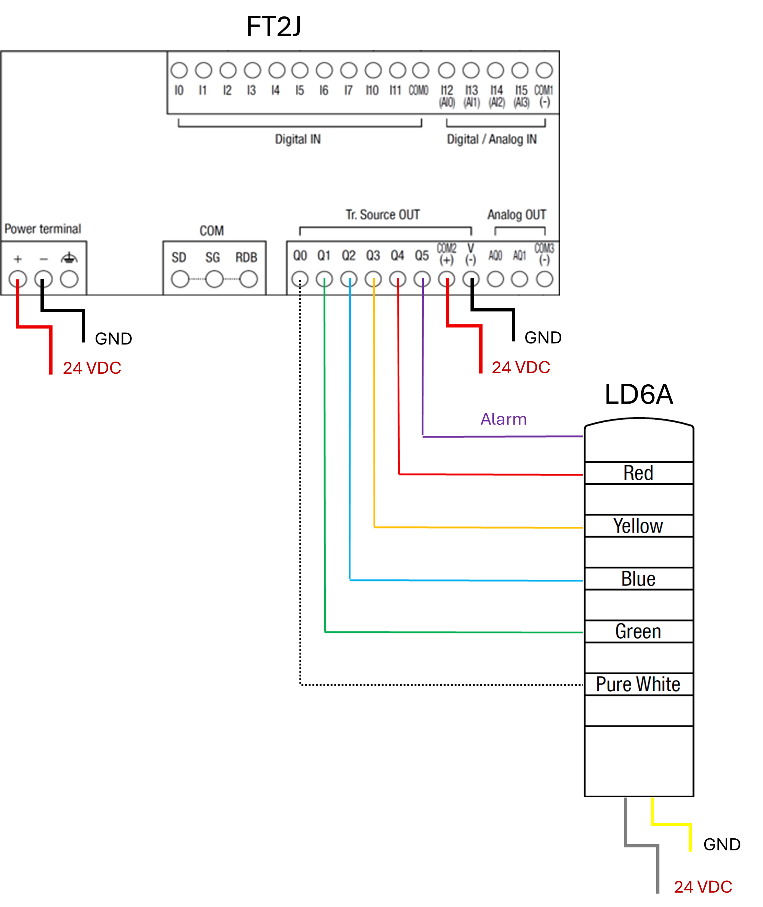

## 2 - Network Configuration

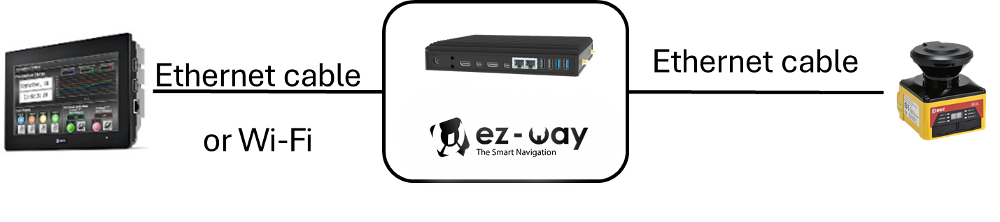

|   | FT2J | IPC ez-Way | SE2L |
| - | - | - | - |
| Ethernet0 |   | 10.0.0.2 | 10.0.0.5 |
| Ethernet1 | 10.1.0.125 : 2537 | 10.1.0.2 : 1883 |   |
| Wi-Fi 0 | 10.42.0.150 : 2537 | 10.42.0.1 : 2537  |   |
| Wi-Fi 1 |   | 192.168.x.x |   |
| Subnet Mask | 255.255.255.0 |   |   |
| Lo |   | 127.0.0.1 |   |

## 3 - FT2J Interface

For information about the FT2J Interface of this example, please refer to the "FT2J Interface" section of the [Workshop_StarterKit_ez-Way_(FT2J)](https://github.com/IDEC-ezWheel/ez-Way_and_FT2J_example/blob/main/Workshop_StarterKit_ez-Way_(FT2J).pdf) document you can find in this repository.

To read this PDF, it is recommended to use an other editor than the one provided by GitHub

## 4 - Configuring the FT2J

The Ethernet and Wi-Fi configurations will be done on the "Project Settings" panel of the WindOI software.

To access the "Project Settings" panel, go to: Configuration/Project

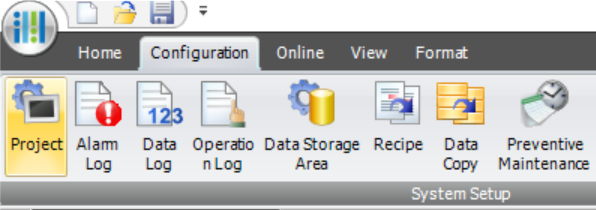

### 4.1 - Ethernet Communication

To configure the FT2J IP and Port for Ethernet Communication, go to: Project Settings/Communication Interface/Ethernet

This configuration is required for wired MQTT communication through Ethernet cable.

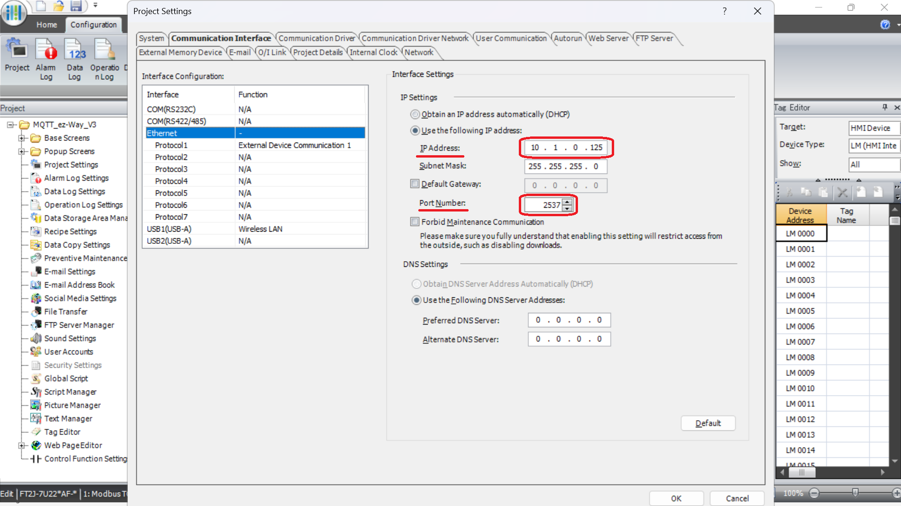

### 4.2 - Wi-Fi Communication

In our case, the FT2J will be able to communicate wirelessly with the robot's access point via a Wi-Fi dongle connected on the USB1 port of the FT2J

To configure the Wi-Fi LAN, go to: Project Settings/Communication Interface/USB1(USB-A)

Then, the following fields can be configured:
* The "Function" of the USB port should be set to "Wireless LAN"
* The "Network Name (SSID)" and "Password"
* The IP and Port

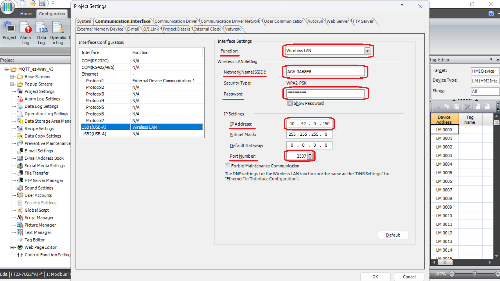

### 4.3 - MQTT Communication

In our case, the FT2J will be able to communicate using the MQTT protocol with the robot's local broker via Wi-Fi using the dongle or via an RJ45 Ethernet cable.

To open the "MQTT Settings", go to: Project Settings/Network

Then click on the "Settings" button

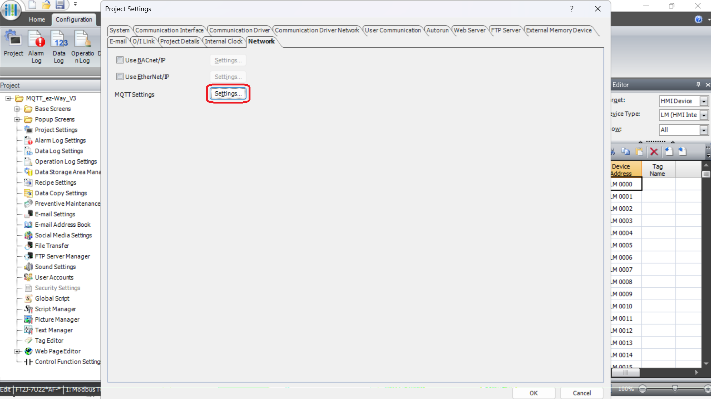

On the "MQTT Settings" panel, there are 3 pages:
* MQTT Settings
* Publish
* Subscribe

The "Publish" and "Subscribe" panels will be explained in the [Explanation of the code / MQTT Messages](#52---mqtt-messages) section of this document.

On the MQTT Settings page, the following fields can be configured:
* The IP and Port of the MQTT Broker
* The "Client ID", a unique ID for each ez-Wheel robot and used in the MQTT topics names. In this example, it will be stored in the "Data Register" D 3140.
* The "Connection Control" and "Connection Status", used in the LADDER program to control and have feedback on the connection's status to the MQTT Broker. They will be stored respectively in the "Internal Relay" M 0000 and the "Data Register" D 0000.

For **wireless** MQTT communication the IP address must be set to "10.42.0.1".

For **wired** MQTT communication with Ethernet cable, the IP address must be set to "10.1.0.2".

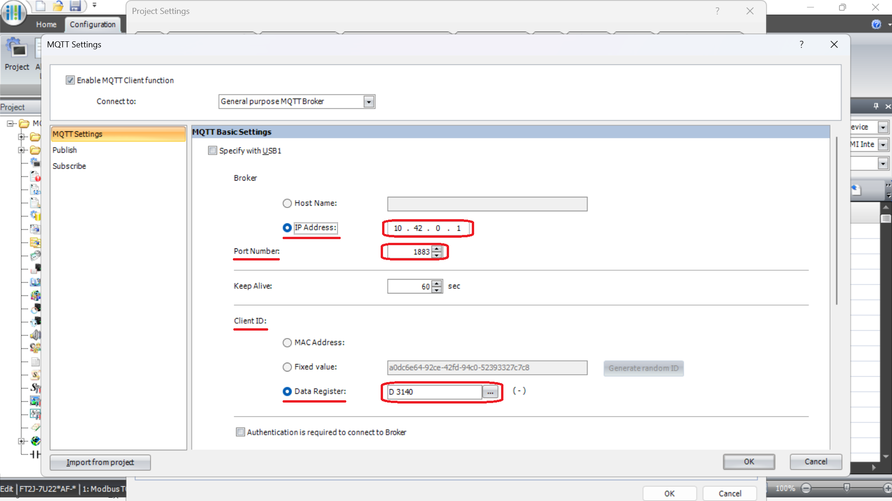

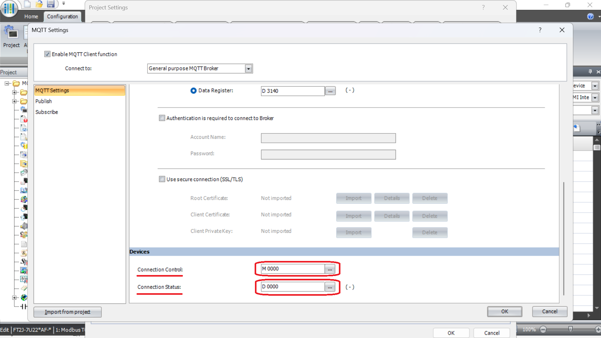

### 4.4 - Downloading a program or a configuration

The Download of the program and configuration will be done on the "Download" panel of the WindOI software.

To access the "Download" panel, go to: Online/Download

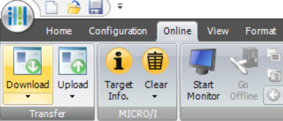

On the "Download" panel, the target devices can be managed by clicking on "Target List"

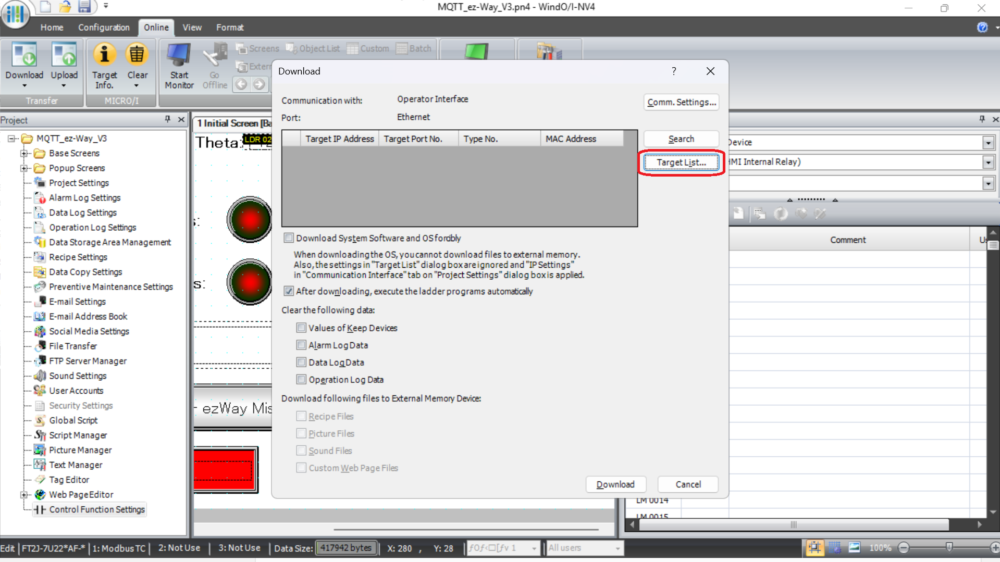

On the "Target List" panel, new devices can be added by clicking on the "Add" button

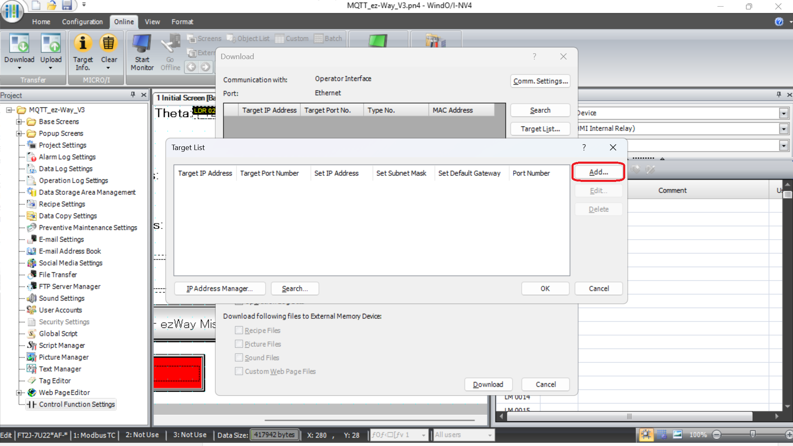

In this example, there are 2 ways of targeting the FT2J:

1. Using Ethernet cable:
    
    On the first download, the Wireless LAN is not yet available, the only option is to connect the computer to the FT2J with an RJ45 Ethernet cable to download the program and configuration.
    
    In this case, the default IP address and Port of the FT2J can be used

    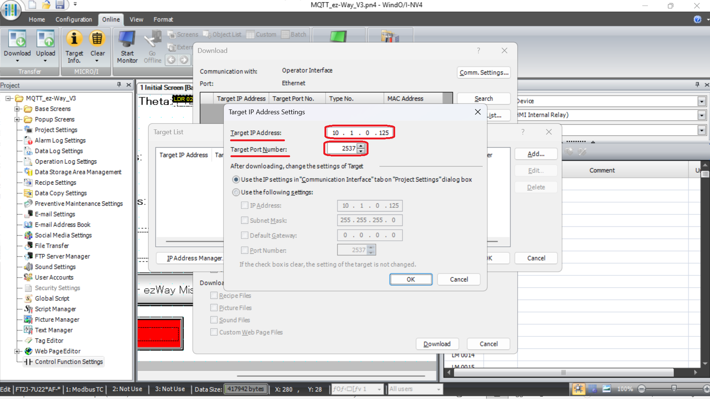
    
2. Using Wireless LAN:
    
    Once the Wireless LAN is configured on the FT2J as well as its IP address and Port, the program and configuration can be downloaded through this Wireless LAN.

    The FT2J being connected to the robot's access point, the computer needs to be connected to it as well, in this case the following IP address and Port can be used

    

Finally, the program and configuration can be downloaded on the FT2J by selecting the corresponding target and clicking on the "Download" button.

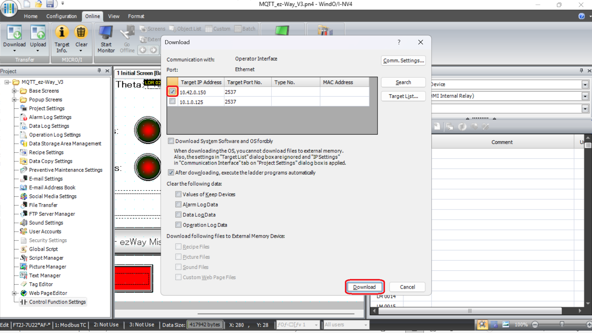

## 5 - Explanation of the code

This section of this document will focus on the explanation of the code of this specific example. This is not a manual explaining how to program on the FT2J.

If documentation is needed on how to program on the FT2J, please refer to the manuals available on the [FT2J Controller with Operator Interface](https://eu.idec.com/idec-eu/en_EU/Automation/Operator-Interfaces/PLC%2BHMI/FT2J-Controller-with-Operator-Interface/c/FT2J_Series?page=1) page in the IDEC website:

### 5.1 - Organization of the Memory

#### 5.1.1 - Control device

Data register (D):

* [D 0000]: MQTT Broker connection status
* [D 1000] – [D 1999]: Publish status of MQTT messages
* [D 2000] – [D 2999]: Subscribe status of MQTT topics
* [D 3000] – [D 3999]: Other variables
  * [D 3000]: Header ID, used in every message
  * [D 3010] – [D 3099]: Variables used in the "Go to point" order messages
  * [D 3100] – [D 3199]: Variables used in every message (Order ID, serial number)
  * [D 3200] – [D 3299]: Constant strings
  * [D 3400] – [D 3499]: Variables used in the Instant Actions messages
  * [D 3600] – [D 3799]: Mission Names, used for the "ez-Way Mission" messages
  * [D 3800]: Standalone Manager Command
  * [D 3900] – [D 3999]: X, Y, Theta of each Kitting Station (A, B, C) and Loading Area of the "Go to Point" orders

Internal Relay (M):

* [M 0000] – [M 0099]: Manage the MQTT Broker
* [M 0100] – [M 0399]: Triggers used to publish MQTT messages or sequences of MQTT messages
* [M 0500] – [M 0599]: Flags to unsubscribe and visualize success and data reception of subscribed MQTT topics
* [M 1000] – [M 1999]: Flags to publish and visualize success of published MQTT messages
* [M 2000] – [M 2999]: Flags to subscribe to an MQTT topic
* [M 3000] – [M 3999]: Other variables
  * [M 3800]: Standalone Manager Value

Timer contact (T):

* [T 000] – [T 099]: Delays of MQTT messages
* [T 100] – [T 110]: Delays in sequences of MQTT messages

#### 5.1.2 - HMI device

Data register (LDR):
* [LDR 02000] – [LDR 03999]: related to the corresponding subscribed MQTT topic
  * [LDR 02000] – [LDR 02099]: "uagv/v2/ez-Wheel /client id/visualization" [M 2000]
  * [LDR 02100] – [LDR 02199]: "uagv/v2/ez-Wheel/client id/state" [M 2100]
  * [LDR 02200] – [LDR 02299]: "amr_manager/state" [M 2200]
  * [LDR 02300] – [LDR 02399]: "error_manager/state" [M 2300]
  * [LDR 02400] – [LDR 02499]: "standalone_manager/state" [M 2400]
  * [LDR 02500] – [LDR 02599]: "standalone_manager/result"[M 2500]
* [LDR 03000] – [LDR 03999] Other variables
  * [LDR 03000]: Header ID
  * [LDR 03100]: Order ID

Internal Relay (LM):

* [LM 02000] – [LM 03999]: related to the corresponding subscribed MQTT topic
  * [LM 02000] – [LM 02099]: "uagv/v2/ez-Wheel /client id/visualization" [M 2000]
  * [LM 02100] – [LM 02199]: "uagv/v2/ez-Wheel/client id/state" [M 2100]
  * [LM 02200] – [LM 02299]: "amr_manager/state" [M 2200]
  * [LM 02300] – [LM 02399]: "error_manager/state" [M 2300]
  * [LM 02400] – [LM 02499]: "standalone_manager/state" [M 2400]
  * [LM 02500] – [LM 02599]: "standalone_manager/result"[M 2500]

### 5.2 - MQTT Messages

The structure of the MQTT Messages is defined in the "Publish" and "Subscribe" pages in the "MQTT Settings" panel. To open this panel, please refer to the [Configuring the FT2J / MQTT Communication](#43---mqtt-communication) section of this document.

For clarity, the MQTT messages will be referred to, using the corresponding "Publish Control" register. The messages are also grouped by MQTT topic for better understanding.

#### 5.2.1 - Publish

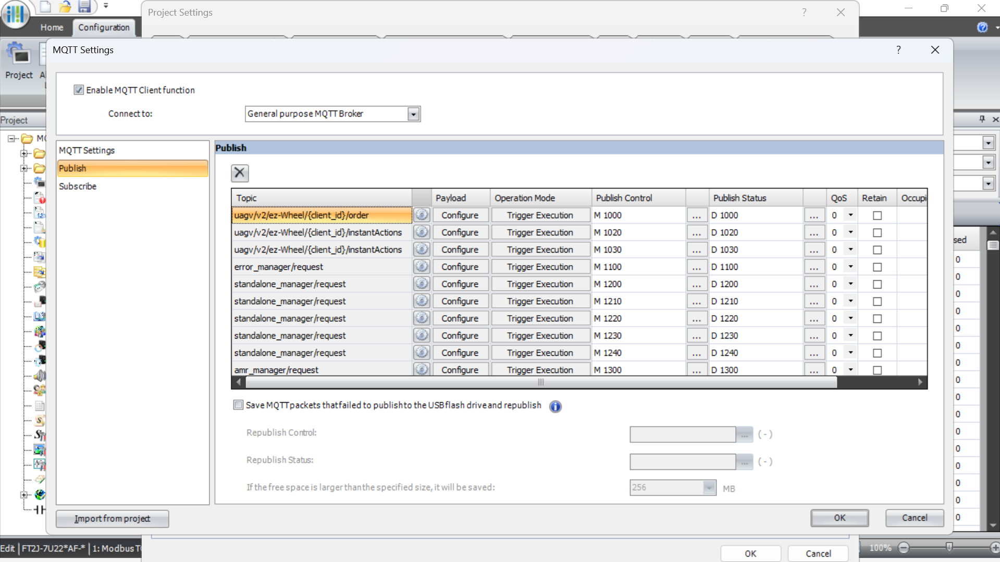

MQTT Messages on a topic starting with "uagv/v2/ez-Wheel/client_id"

* [M 1000]: In the topic "order", used in the "Go to Point" Orders to move the robot from the Loading Area to Kitting Stations (A, B, C) and coming back
* [M 1020]: In the topic "instantActions" with no parameters, used to send the "Cancel Order" and "State Request" messages
* [M 1030]: In the topic "instantActions" with 1 parameter, used to send the "Select Navigation" message

MQTT Messages on the topic "error_manager/request"

* [M 1100]: Acknowledge Error, used when an error needs to be acknowledged (ex: Estop)

MQTT Messages on the topic "standalone_manager/request"

* [M 1200]: Save a specific mission on ez-Way. Before starting an ez-Way mission, it needs to be saved, then applied
* [M 1210]: Apply the previously saved mission on ez-Way. Now the mission is loaded and ready to be started
* [M 1220]: Initialize and start the loaded mission. This sequence of 3 messages ([M 1200], [M 1210], [M 1220]) is used to start the "ez-Way Missions"
* [M 1230]: Init Pose. used before the "Go to Point" Orders to set the robot's position values (X, Y, Theta)
* [M 1240]: Set Value of the standalone manager. Used to send the "Pause", "Resume" and "Stop" messages

MQTT Messages on the topic "amr_manager/request"

* [M 1300]: Change the Operating Mode of the robot (MANUAL or AUTOMATIC)

#### 5.2.2 - Subscribe

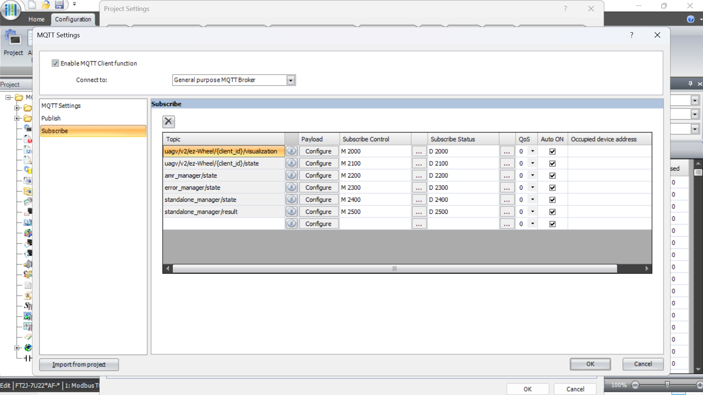

MQTT topics starting with "uagv/v2/ez-Wheel"

* [M 2000]: "client_id/visualization", used to retrieve the robot's position (X, Y, Theta)
* [M 2100]: "client_id/state", used to retrieve the robot's battery state (charge and voltage), and its safety state (Estop and field violation)

MQTT topics starting with "amr_manager"

* [M 2200]: "amr_manager/state", used to retrieve the robot's operating mode

MQTT topics starting with "error_manager"

* [M 2300]: "error_manager/state", used to retrieve the last error name, acknowledge type (if it can be acknowledged), state (if it needs to be acknowledged), and id

MQTT topics starting with "standalone_manager"

* [M 2400]: "standalone_manager/state", used to know if the loaded mission is in progress
* [M 2500]: "standalone_manager/result", used to know if a request in the standalone manager succeeded by retrieving its id and success status.

### 5.3 - Global Scripts

The Global Scripts can be configured on the "Global Scrip Settings" panel of the WindOI software.

To access the " Global scrip settings " panel, go to: Configuration/Global Script

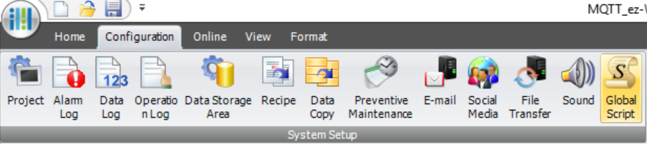

In this example, the 7 following "Global Scripts" are used

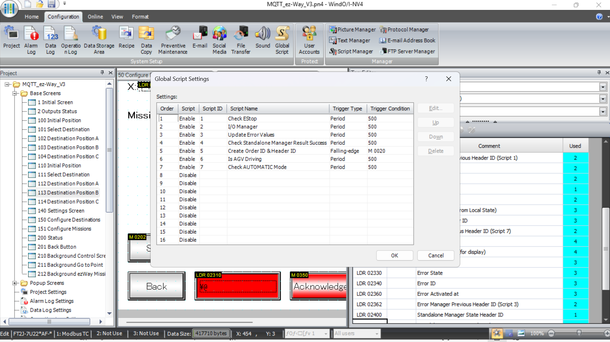

All the scripts except the script 5 are executed periodically every 500 ms.

The script 5 is executed just after sending any MQTT message, when the internal relay [M 0020] is cleared, to create a new "Oder ID" and "Header ID"

All the scripts except the script 2 and 5 are using values updated by subscribed MQTT topics. They are executed periodically and are expensive in calculations, so each script will check whether the header ID of the MQTT message in question has changed since the last execution. If the header ID has not changed, it means that none of the other values of the MQTT Message has changed, so the rest of Script will not be executed.

#### 5.3.1 - Script 1: Check Estop

This script checks if the Estop is activated by comparing a string received in the subscribed MQTT topic "uagv/v2/ez-Wheel/client id/state" [M 2100] to a constant string.

Explanation of some registers used in the script:

* [LDR 02130] string indicating the state of the Estop. "NONE" means the Estop is not activated, "MANUAL" means the Estop is activated or needs to be acknowledged. Updated by the subscribed MQTT topic "uagv/v2/ez-Wheel/client id/state" [M 2100]
* [D 3260] constant string containing "MANUAL"
* [LM 2100] indicates if the Estop is activated. Used in the HMI and in the script 2 to update the LEDs

#### 5.3.2 - Script 2: I/O Manager

This script updates the FT2J's outputs to control the LEDs & buzzer on the LD6A.

Explanation of some registers used in the script:

* [LM 2101] indicates if an obstacle is detected by the scanner (SLS / SDI). Updated by the subscribed MQTT topic "uagv/v2/ez-Wheel/client id/state" [M 2100]
* [LM 2100] indicates if the Estop is activated. Updated by the script 1

#### 5.3.3 - Script 3: Update Error Values

This script checks if there is an active error and enables displaying its name (line 17). It also enables displaying the acknowledge button when the "ack_type" of the error is "ACK" and its "state" is "WAITING_ACK" (line 33).

The registers used to store the error values are cleared when the error array is empty because they will not be updated automatically anymore. (line 22 to 25)

Explanation of some registers used in the script:

* [D 2303] error code of the subscription to the MQTT topic "error_manager/state" [M 2300]. If its value is 0, there is no error. If its value is 4, that means the format of the message is invalid, in other words the error list is empty. Updated by the LADDER program
* [LM 2300] enables displaying the error name. Used in the HMI
* [LM 2301] enables displaying the acknowledge button. Used in the HMI
* Updated by the subscribed MQTT topic "error_manager/state" [M 2300]:
  * [LDR 2300] error name string.
  * [LDR 2320] error ack_type string
  * [LDR 2330] error state string.
  * [LDR 2340] error ID string.
* [D 3280] constant string containing "ACK"
* [D 3290] constant string containing "WAITING_ACK"

#### 5.3.4 - Script 4: Check Standalone Manager Result Success

This script checks if the last request sent in the topic "standalone_manager/request" has been successfully processed, in our case the MQTT messages [M 1200], [M 1210] and [M 1220].

To do so, it checks in the subscribed MQTT topic "standalone_manager/result" [M 2500] if the request ID is the sale and if the "success" variable is true.

Explanation of some registers used in the script:

* Updated by the subscribed MQTT topic "standalone_manager/result" [M 2500]:
  * [LM 2500] "success" variable of the last result received
  * [LDR 2500] request ID string of the last result received
* [D 3120] request ID string of the last request sent. Updated by the LADDER program
* [M 0155] indicates if the last request has been successfully processed. Used in the LADDER program

#### 5.3.5 - Script 5: Create Order ID & Header ID

This script increments the header ID by 1 and converts it into a string to create the Order ID.

Explanation of some registers used in the script:

* [D 3000] header ID integer Used to send the MQTT messages
* [D 3100] Order ID string. Used to send the MQTT messages
* [M 0020] indicates if the Order ID has been created. Used in the LADDER program

#### 5.3.6 - Script 6: Is robot Driving

This script detects if the robot is moving by comparing its current position (X, Y) and orientation (Theta) to its previous value. If one of those 3 values has a difference with its previous value of more than 0.001, the robot is considered moving.

Explanation of some registers used in the script:

* [LM 2000] indicates if the robot is moving. Used in the HMI
* [LDR 2000] current X float
* [LDR 2002] current Y float
* [LDR 2004] current Theta float
* [LDR 2020] previous X float
* [LDR 2022] previous Y float
* [LDR 2024] previous Theta float
* [LDR 2030] difference of X float
* [LDR 2032] difference of Y float
* [LDR 2034] difference of Theta float

5.3.7 - Script 7: Check AUTOMATIC Mode

This script checks if the robot's operating mode is "AUTOMATIC" by comparing a string received in the "amr_manager/state" topic [M 2200] to a constant string.

Explanation of some registers used in the script:

* [LDR 02200] string indicating the robot's operating mode. Updated by the subscribed MQTT topic "amr_manager/state" [M 2200]
* [D 3270] constant string containing "AUTOMATIC"
* [LM 2200] indicates if the robot's operating mode is "AUTOMATIC". Used in the HMI

### 5.4 - LADDER Code

#### 5.4.1 - Main Program

Rung 1: Initialize data (constant strings, variables, triggers…)

Rung 2: Manage MQTT Broker Connection

Rung 3 – 8: Publish the MQTT messages to execute the "Go to Point" orders

Rung 9 – 14: Start the sequence for ez-Way missions with the corresponding parameters

Rung 15: Publish the sequence to start an ez-Way mission

* Step 0: Publish the "Save Mission" MQTT message
* Step 1: Wait until the message is sent
* Step 2: When a successful result is received for the previous message, publish the "Apply Mission" MQTT message.
* Step 3: Wait until the message is sent
* Step 4: When a successful result is received for the previous message, publish the "Init Mission" MQTT message.

Rung 16 – 18: Publish the individual MQTT messages of the "Start Mission Sequence" ("Save Mission", "Apply Mission" and "Init Missions")

Rung 19 – 21: Publish "Pause", "Resume" and "Stop" MQTT messages

Rung 22: Publish the sequence to initialize the robot's position

* Step 0: Publish the "Cancel Order" MQTT message
* Step 1: When the previous message is sent, publish the "Select Navigation" MQTT message
* Step 2: When the previous message is sent, publish the "Init Position" MQTT message
* Step 3: When the previous message is sent, publish the "Cancel Order" MQTT message
* Step 4: When the previous message is sent, publish the "State Request" MQTT message

Rung 23 – 26: Publish the individual MQTT messages of the "Init Position Sequence" ("Select Navigation", "Init Position", "Cancel Order", "State Request")

Rung 27 – 28: Publish the MQTT messages to change the robot's operating mode ("AUTOMATIC', "MANUAL")

Rung 29: Publish the MQTT message to acknowledge the error

Rung 30 – 35: Triggers to subscribe to each MQTT topic ("Visualization", "VDA5050 State", "Local State", "Error Manager State", "Standalone Manager State", "Standalone Manager Result")

Rung 36: END of the program

#### 5.4.2 - Macro 0: Publish to MQTT Broker

When the MQTT Broker is successfully connected, and the Order ID is created:

* At the start of the "Trigger to Publish" signal, the "Publish Status" register is cleared (set to 0), and the "Publish Control" relay is set to 1 (sending the corresponding MQTT message)
* While the "Trigger to Publish" relay is at 1:
  * If the "Publish Status" register value is 4, the "Publish Success" relay is set to 1
  * If the "Publish Status" register value is 16, the "Publish Failed" relay is set to 1
* At the end of the "Trigger to Publish" signal, the "Publish Control" relay is set to 0

When the "Publish Success" or "Publish Failed" relay is at 1, the "Trigger to Publish" relay is set to 0, the "Publish Success" and "Publish Failed" relays are set to 0, and the trigger to create a new Order ID is set to 0.

#### 5.4.3 - Macro 1: Subscribe to MQTT Broker

When the MQTT Broker is successfully connected, while the "Subscribe Control" relay is at 1:

* If the "Subscribe Status" register value is 4, the "Subscribe Success" relay is set to 1
* If the " Subscribe Status" register value is 16, the " Subscribe Failed" relay is set to 1
* If the "Unsubscribe" relay is at 1, the "Subscribe Control" relay is set to 0
